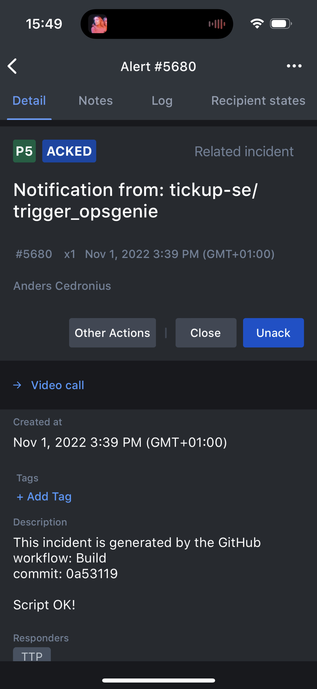

# Send incident to OpsGenie

GitHub action sending custom incidents to opsgenie.

For the action to integrate with your OpsGenie installation you need an API key. The API key may be obtained from the organisations OpsGenie frontpage under **Settings** (upper right) -> **APP SETTINGS** (section to the left) -> **API key management**. The API key management requires a privileged account.

You also need a configured **team** as a recipient of the incidents. If you misconfigure this part the incident will be sent to your OpsGenie system and this script will report success, however since there are no matching recipients on the other end no one will get notified.

## Parameters

**API_KEY**

Your OpsGenie secret API key. Use the repository or organization secrets as your key storage.

**PRIORITY**

The priority level of your incident (P1 -> P5)

**MESSAGE**

Your message. Will be part of the description part of the incident.

**TEAM**
 
The team to address this incident to 

**TAGS** (Optional)

Custom tags

## Prefilled information

The incident report alreday contains decorated information consiting of:

**head**

The repository name

**Decription**

Workflow name

Short SHA (7 characters)

**Details**

Runner OS

Runner Arch

Branch

## Usage

Sending incidents to OpsGenie may be triggered by just failing actions or by advanced expressions. GitHub has put together a great guide: 

[GitHub action expressions](https://docs.github.com/en/actions/learn-github-actions/expressions)

#### Example Usage:

```yaml
- name: Send OpsGenie incident
  if: success()
  uses: tickup-se/notify_opsgenie@v1
  with:
    API_KEY: ${{ secrets.OPS_GENIE }}
    PRIORITY: 'P5'
    MESSAGE: 'Some text'
    TEAM: 'existing teamname' 
``` 


# Incident example on an iPhone


